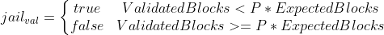

# FIP11: Validator Jailing

## Problem

We have had situations in the past were nodes go down for several days or months. This imposes a large problem as it increases block times which in turn increases transaction times and lowers network throughput. 

## Goals

Remove any misbehaving validators from the current and future validator set until they signal to the consensus that they are back online.

This will:

* Ensure the block time is consistent.
* Ensure we have maximum transaction throughput.
* Ensure all transactions times are <5seconds. 

## Suggestion

### Auto-Removal

The consensus will be changed to count the number of blocks mined by each node per cycle.
 
At the end of the cycle the consensus will check the performance of each validator. If the number of blocks validator by a validator falls below the expected threshold the validator will be moved from the pending list into the new “jailed list”.

Whilst in the jailed list the validator will not be selected to validator blocks. It is the node operators responsibility to fix any issues present with their node and get it back in sync with the network. Once in sync the operator can request that their node be moved out of the jailed list and back into the pending list at the start of the next cycle.

Where P = Productivity threshold

The suggested value for P is 30% (0.3) this means that a validator who validates less than 30% of their blocks in a given cycle will be jailed. In real world terms this equates to a downtime of ~33.5hrs in a single 48hr cycle.

### Strike system

To ensure that operators maintain their nodes in a timely manor a strike system will be put in place for repeat offenders
* 1st strike - 1 cycle min jail time
* 2nd strike - 2 cycle min jail time
* 3rd strike - 3 cycle min jail time
* 4th strike - 4 cycle min jail time
* 5th (max) strike - 5 cycle min jail time

Strikes get reset after 50 cycles of not being jailed.

### Recovery

Jailed validators will remain in jail until they signify they are ready to be released this will result in them being released on the next cycle or once their jail time is up (which ever comes last).

### Node maintenance

If an operator foresees down time (server migration for example) they will be able to signal to be moved into the jailed list from the start of the next cycle and will need to signal when they are ready to start again. **This will not Incur any strikes**

