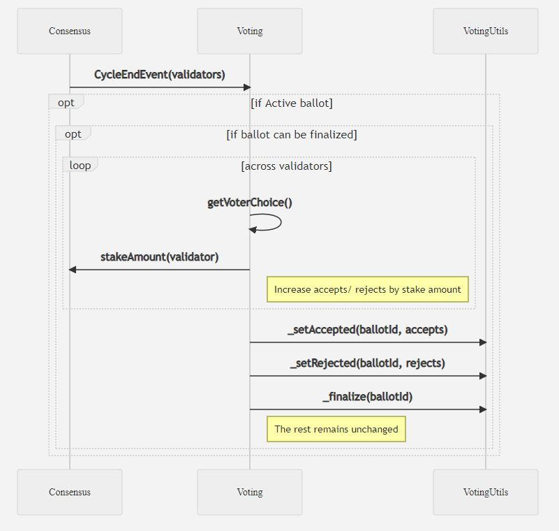

# FIP9: Scale Vote Weight by Stake

## Problem 
Currently each validator has the same influence on voting regardless of their stake.

## Goals 

Scale the weight of a validators vote based on the amount staked to that validator. This will ensure that each 1 fuse staked equates to 1 vote (as opposed to the existing 1 validator equating to 1 vote).

## Implementation

Alter the onCycleEnd method of the voting contract to query the consensus contract and check the amount staked to that validator. The stake will then be added to the accept or reject counters (as apposed to 1 used previously)

Implementation PR: https://github.com/fuseio/fuse-network/pull/99/commits

## Example 

* Validator X has a stake of 100000 
* Validator Y has a stake of 200000 
* Validator Z has a stake of 50000 

Ballot 1 is submitted: 

Validator X and Z both vote for Ballot 1 and Validator Y votes against. 

* Accepted = 100000 + 50000 = 150000 
* Rejected = 200000 

Ballot 1 would be rejected as rejected is greater than Accepted (previously this would be accepted as all 3 would be treated equally)

## Testing

Deployed on the test net at block 43480 (ballot ID 2). Implementation tested on ballot 3.